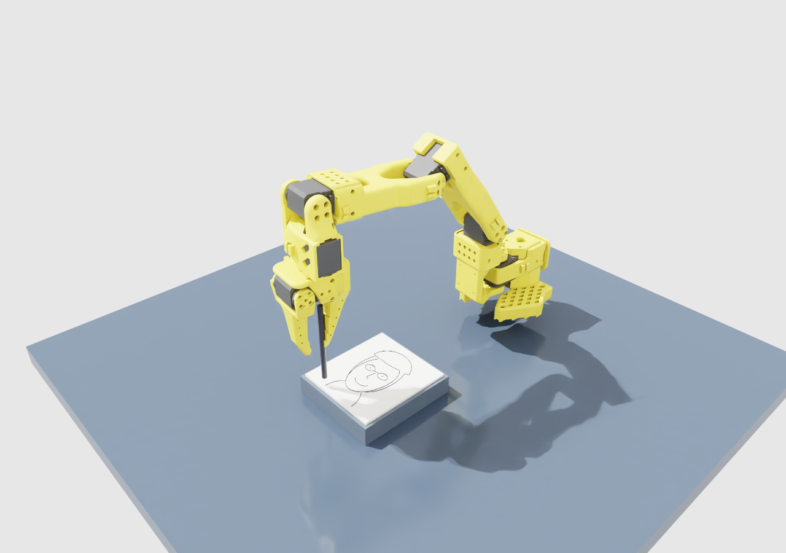

# Sim Sketch Artist

Take a webcam portrait on your Mac. Astra turns it into simple pen strokes, and
an SO-101 in Isaac Sim draws them on a virtual sheet of paper.

**Browser studio with live robot view:** https://twenty-barnes-framework-battle.trycloudflare.com/

**Interactive Isaac Sim viewer:** https://twenty-barnes-framework-battle.trycloudflare.com/sim/view

**Lovable app:** https://sim-sketch-artist.lovable.app/

**Lovable project:** https://lovable.dev/projects/23eb3da7-7b3a-499d-a095-c1112a6b197e

The live app requires the Ubuntu backend, HTTPS tunnel and Isaac Sim worker to
remain running. The tunnel address can be changed in Connection settings.



The image above is an actual Isaac Sim run using a synthetic test portrait.
See [verification notes](docs/verification.md) for what has been tested.

```text
Mac webcam / upload in Lovable
              |
         HTTPS tunnel
              |
Ubuntu FastAPI ---> OpenAI Responses API (ASTRA_MODEL)
              |
       atomic jobs/<uuid>/ files
              |
Isaac Sim 5.1 Python ---> SO-101 joint motion + measured pen trail
              |
       live viewport + result.png ---> Mac browser
```

The browser's **Sketch me** action creates the portrait and queues the drawing.
Astra receives the photo and returns only bounded line coordinates. No model
output is executed as code. The backend uses a regular Python environment;
Isaac Sim uses its own `python.sh`. The file queue keeps those environments separate.

## Run on Ubuntu

Requirements: Python 3.11+, Node.js 22+, an installed Isaac Sim 5.1 with a supported
NVIDIA GPU, and OpenAI API access to the Astra model you configure.

```bash
./scripts/setup.sh
```

Edit the ignored `.env` file:

```dotenv
OPENAI_API_KEY=your-api-key
ASTRA_MODEL=the-exact-model-id-enabled-for-your-account
ISAAC_SIM_PATH=/absolute/path/to/isaac-sim
OPENAI_TIMEOUT_SECONDS=180
```

The key and model have no code defaults. The browser never receives the API key.
An event-provided API endpoint can be set with `OPENAI_BASE_URL`.
`ASTRA_STRUCTURED_OUTPUTS=false` disables schema enforcement only if the selected
endpoint does not support it; validation and the one correction retry remain.

Build the browser app before starting the backend (setup does this). Run these
in separate terminals from the repository root:

```bash
./scripts/backend.sh
./scripts/sim.sh
```

Open `http://localhost:8000` for the reference browser app. It supports webcam
capture, upload, animated preview, automatic queueing, progress and results.
Its live camera shows actual rendered frames from the running Isaac Sim worker,
including the SO-101's motion and ink. The camera publisher captures at up to
5 frames per second; the browser requests frames sequentially about every
400 ms. Disconnected or stale frames are clearly labelled. This is a live
simulator view, separate from the planned stroke preview and recorded demo video.

Drag the camera image to orbit, scroll to zoom, and Shift-drag or right-drag to
pan. The **Whole scene**, **Paper close-up** and **Top view** presets move the
actual Isaac Sim camera. **Open separate viewer** opens `/sim/view`; fullscreen
is also available. Arrow keys orbit, Shift+arrows pan, +/− zoom and R resets.
Camera changes are shared between viewers and work while the arm draws. These
controls change the scene camera; they do not expose the native Isaac editor.
The renderer uses a fixed 1280×900 image, fitted without cropping in the browser.
`GET /health` verifies the HTTP service only; it does not assert that Isaac Sim
or the model is working. `GET /ready` reports whether model credentials are configured.

The SO-101 asset is fetched from NVIDIA's Isaac Sim 5.1 asset collection when
needed and kept out of Git. See [sim/README.md](sim/README.md) for drawing modes,
paper calibration and testing. The default is the robot; the explicit marker
fallback is a visualization and is labelled as such.

## Connect the Mac and Lovable

With `cloudflared` installed, keep this running on Ubuntu:

```bash
./scripts/tunnel.sh
```

It prints a temporary HTTPS URL. Open its `/health` path on your Mac to verify
connectivity. The same URL also serves the reference app, so you can try webcam
capture immediately. A quick tunnel changes URL when restarted and stops when
its process stops. Keep Ubuntu awake with the backend, tunnel and simulator running.

Create or open the Lovable project and paste [docs/lovable-prompt.md](docs/lovable-prompt.md).
Set `VITE_API_BASE_URL` or the app's Connection setting to the HTTPS tunnel URL.
Use the published HTTPS app on your Mac and grant it webcam permission. Its
requests call this Ubuntu API directly. API keys belong only in Ubuntu's `.env`.

The linked Lovable app has been created, published and tested against this backend.
The `frontend/` directory is a separately runnable reference implementation.
The new live camera is available in this reference app and as `/sim/view` for
embedding in Lovable; see [the Lovable live-view instructions](docs/lovable-live-view.md).
The live camera addition has not yet been applied to the hosted Lovable project.
Lovable supports exporting a new project
to GitHub and syncing subsequent code changes, but not directly importing an
existing repository as a new project.

## API and drawing format

| Endpoint | Contract |
| --- | --- |
| `GET /health` | `{"ok":true}` |
| `POST /portrait` | Multipart `image` (JPEG/PNG/WebP, max 10 MB); returns `title`, `strokes`, `preview_url` |
| `POST /draw` | JSON drawing below; returns `{"job_id":"uuid"}` with HTTP 202 |
| `GET /status/{job_id}` | `state`, `stroke`, `total`, `error` |
| `GET /trail/{job_id}` | Measured normalized pen-tip strokes |
| `GET /result/{job_id}` | PNG rendering of the measured trail |
| `GET /sim/status` | Current camera state, job progress and frame freshness |
| `GET /sim/frame` | Latest actual viewport JPEG; HTTP 503 if unavailable or stale |
| `POST /sim/camera` | Bounded `yaw`, `pitch`, `distance`, `target`; HTTP 202 with `command_id` |
| `GET /sim/view` | Interactive camera page, ready to embed in Lovable |

```json
{"title":"Diagonal","strokes":[[[0.2,0.2],[0.8,0.8]]]}
```

Camera commands are atomically replaced with the newest requested pose. The
worker acknowledges `camera_command_id` in `/sim/status` only after applying
and reading back the actual USD camera. Offline workers reject camera commands.

Coordinates are in `[0,1]`, origin top-left. There are 1–40 strokes with 2–25
points per stroke. Astra output is validated, repaired within these limits and
ordered to reduce pen travel. `/draw` rejects invalid input. The simulator
interpolates intermediate targets; its measured trail can contain more points.
The same stroke format can target a physical SO-101 after calibration and an
appropriate hardware controller; this project controls only the simulation.

Each job folder holds `strokes.json`, `status.json`, `trail.json` and `result.png`.
States are `queued`, `running`, `done`, `error`. JSON writes and job publication
are atomic. A claimed job is never automatically replayed after a crash. Inspect
the simulator and submit a new job if a run was interrupted.

## Verify

```bash
.venv/bin/python -m pytest tests -q
npm --prefix frontend run build
./scripts/sim.sh --sample samples/smiley.json --once
```

Use **Try sample strokes** in the browser to test the queue and simulator without
spending an API request. Then test your own photo with **Sketch me**. A completed
sample checks robot drawing, not Astra's likeness quality or Mac camera permissions.
Record a complete Mac-to-simulator run for the submission after both are verified.

## Demo scope and data

This is a hackathon demo with permissive CORS and no user accounts. Anyone with
the tunnel URL can submit jobs and consume the configured API budget. Stop the
tunnel after the demo. Input photos are processed in memory and sent to OpenAI;
the app does not save them locally. Derived previews, strokes and results remain
in ignored runtime folders. No secrets, personal photos or downloaded robot
assets are included in the source repository.

Demo video: [36-second SO-101 drawing recording](docs/demo/isaac-drawing.mp4).
It uses the synthetic Astra test portrait, not a webcam session. A recording with
the user's Mac webcam is still pending.

For the supplied event criteria, use the [submission draft and 60-second
narration](docs/submission.md). The existing arm-only recording does not yet
satisfy the complete one-minute screen-and-audio demo requirement.
See [attribution](docs/attribution.md) for the event contribution and dependencies.

## References

- [OpenAI image inputs](https://developers.openai.com/api/docs/guides/images-vision)
- [OpenAI structured outputs](https://developers.openai.com/api/docs/guides/structured-outputs)
- [Lovable GitHub integration](https://docs.lovable.dev/integrations/github)
- [Cloudflare quick tunnels](https://developers.cloudflare.com/tunnel/get-started/quick-tunnels/)
