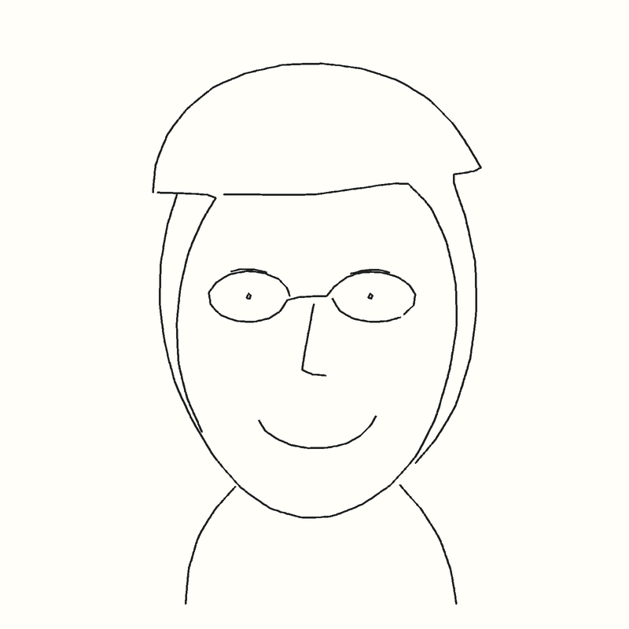

# Verification — 6 October 2026

Local environment: Ubuntu 24.04.4, NVIDIA GeForce RTX 5070 Ti (16 GB), driver
580.178.04, Isaac Sim 5.1.0-rc.19. APIs were checked against this installation.

- 23 backend tests pass: input validation, model request shape/retry/error
  handling, image limits and normalization, concurrent queue claims, path
  validation, previews and result rendering from dense measured trails.
- React/TypeScript production build passes.
- OpenAI authenticated model listing succeeded; the configured Astra model was
  selected from that response rather than guessed.
- Live `/portrait` request: an explicitly synthetic portrait image produced a
  13-stroke, 131-point portrait in 23.7 seconds. Preview inspected visually.
- Isaac Sim SO-101 smiley test: 4 strokes completed with real joint drives.
- Isaac Sim SO-101 Astra portrait test: all 13 strokes completed, 2,058 measured
  pen samples, 6.9 seconds of warm execution. Maximum sampled pen-height deviation
  was 1.24 mm versus a 2 mm threshold. Result and simulator scene inspected visually.
- Numerical inverse kinematics preflight: 50 page and pen-lift targets reached;
  worst target error 0.39 mm.
- The public HTTPS tunnel's `/health` returned `{"ok":true}`.
- A persistent GUI worker reached `SIM_READY mode=robot` on the main jobs folder.
- The reference browser app completed its sample job through the live GUI worker.
- The actual Lovable preview completed both its sample job and an uploaded
  synthetic portrait through HTTPS → Astra → job queue → GUI SO-101 → result.
  The portrait completed 13 strokes and its finished image was visually checked
  in Lovable. This was the real external API, not a browser mock.
- The Lovable app was published at https://sim-sketch-artist.lovable.app/.
- The published site completed a fresh sample job and displayed “Finished — 4
  strokes drawn” with the real result image.
- A 36.375-second H.264 viewport recording contains 873 frames of the SO-101
  drawing the synthetic Astra portrait. Early and late frames were checked.

The simulator uses SO-101 joint drives and a gripper-attached pen. Gravity is
disabled for the arm. Ink appears geometrically when the measured pen tip is
near the paper; pencil pressure and contact forces are not simulated.

These checks do not establish likeness quality for the user's photo, webcam
permission behavior on their Mac, or three real-photo runs. Those require the
user to use the finished app with their webcam. No private photos were accessed
for testing. Demo screenshots are from the synthetic test image.
